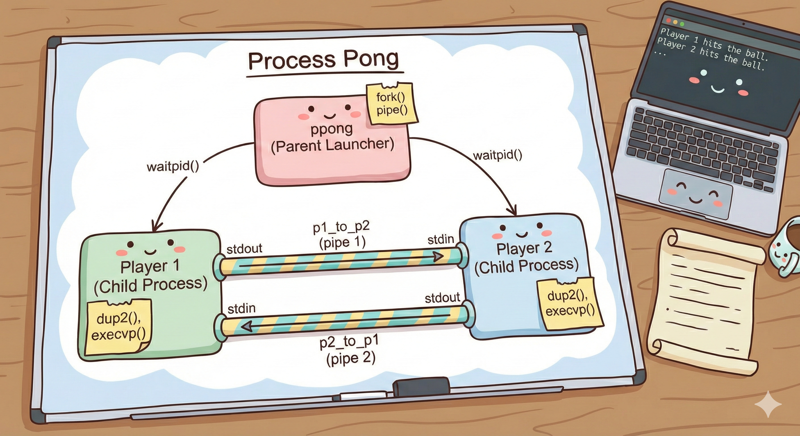

# Process Pong!

> **Attribution:**
> The original author of this problem is [Trip Master](https://github.com/tmaster628), with modifications by Fabio Ibanez.
> [Original repository on GitHub](https://github.com/tmaster628/CS111A_Process_Pong)

<p align="center">
  
</p>

## Overview

Two tennis *processes* rally back and forth! Each process reads its opponent's shot from **stdin** and writes its own shot to **stdout**. You need to write a parent process (`ppong.cpp`) that creates pipes, forks, and uses `dup2` + `execvp` to wire everything together.

Here's a sample run:

```
Player 1 hits the ball.
Player 2 hits the ball.
Player 1 hits the ball.
Player 2 hits the net.
Player 1 wins the point!
```

## Architecture

The launcher creates two pipes and connects two player processes:

```
Player 1 stdout ──[pipe1]──> Player 2 stdin
Player 2 stdout ──[pipe2]──> Player 1 stdin
```

- **Pipe 1** (`p1_to_p2`): carries shots from Player 1 to Player 2.
- **Pipe 2** (`p2_to_p1`): carries shots from Player 2 to Player 1.

Player 1 *serves* first (writes before reading). Player 2 waits to receive (reads before writing, remember read hangs). When a process misses or hits the net, they exit aka return, **which closes their stdout**. The opponent's read returns 0 (EOF) and they exit too. The parent simply waits for both children.

## What's Provided

**`player.cpp`** is fully implemented. You need not read or modify it. All you need to know is:

- It receives its player number (`1` or `2`) and skill level as command-line arguments.
- It uses `read(STDIN_FILENO, ...)` to read the opponent's shot quality (a float).
- It uses `write(STDOUT_FILENO, ...)` to write its own shot quality.
- It uses `fprintf(stderr, ...)` to print the human-readable play-by-play. This is important -- since stdout is redirected to a pipe, the player uses stderr (file descriptor 2) so that messages still appear on the terminal.

## Your Task

Implement **`ppong.cpp`**. You need to:

1. **Create two pipes** using `pipe()`.
2. **Fork Player 1:**
   - Use `dup2` to redirect `STDOUT_FILENO` to the write end of `p1_to_p2`.
   - Use `dup2` to redirect `STDIN_FILENO` to the read end of `p2_to_p1`.
   - Close all four original pipe file descriptors (both ends of both pipes).
   - Call `execvp("./player", ...)` with arguments `"1"` and `"0.8"`.
3. **Fork Player 2:**
   - Use `dup2` to redirect `STDIN_FILENO` to the read end of `p1_to_p2`.
   - Use `dup2` to redirect `STDOUT_FILENO` to the write end of `p2_to_p1`.
   - Close all four original pipe file descriptors.
   - Call `execvp("./player", ...)` with arguments `"2"` and `"0.8"`.
4. **In the parent:** close all pipe FDs (the parent doesn't use them), then `waitpid` for both children.

## Key Concepts

- **`dup2(oldfd, newfd)`**: Replaces `newfd` with a copy of `oldfd`. After `dup2(pipe_write_end, STDOUT_FILENO)`, anything the process writes to stdout goes into the pipe instead.


## Build and Run

```bash
make          # Builds player, ppong, and ppong_soln
./ppong_soln  # Run the reference solution to see expected behavior
./ppong       # Run your implementation (once you've filled it in)
```
